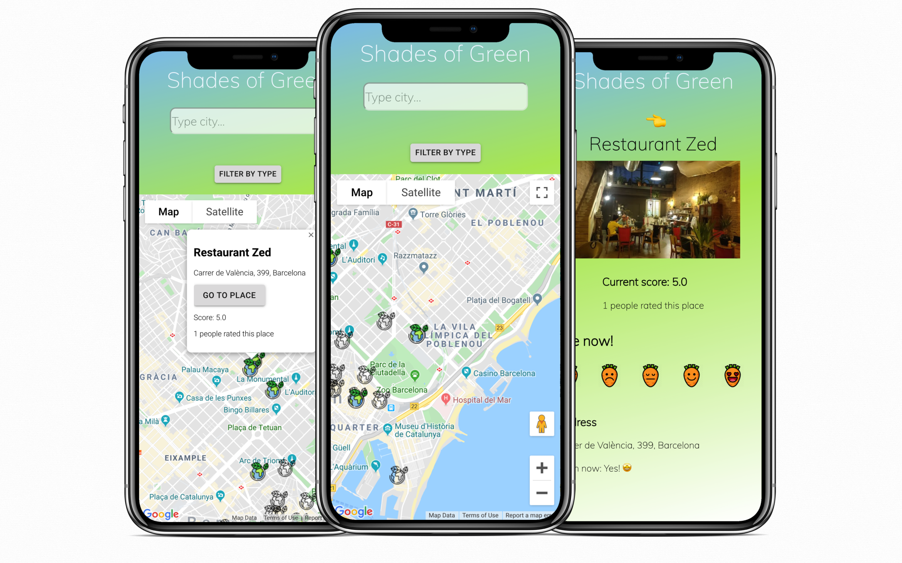

# Shades of Green | Server

<p align="center">
  
</p>


Shades of Green is a web app that allows you to search for places around you, or any other city all around the world, and vote for how vegan-friendly they are. Also, it allows you to filter the search by type (restaurant, shop, supermarket, vegan, etc.) and provides basic info about the place (like opening hours, address, etc.).


## Screenshots

<p align="center">
  
</p>


## Getting started

1. Clone this repo and enter!

   ```bash
   git clone git@github.com:gilatb/shades-of-green-client.git
   ```

2. Install dependencies.

   ```bash
   npm install
   ```

3. Open PostgreSQL database (shades-of-green) and start development server

    ```bash
    npm start
    ```

## Tech Stack

* [React.js](https://reactjs.org)
* [Redux](https://redux.js.org/) 
* [Express.js](https://expressjs.com/)
* [PostgreSQL](https://www.postgresql.org/) 
* [Sequelize](https://sequelize.readthedocs.io/en/v3/)
* Google Maps API:
  * [Maps JavaScript API](https://developers.google.com/maps/documentation/javascript/tutorial)
  * [Geocoding API](https://developers.google.com/maps/documentation/geocoding/intro)
  * [Places API](https://developers.google.com/places/web-service/intro)

## Recommendation

Feel free to have a look at the client of this application: [Shades of Green Client](https://github.com/gilatb/shades-of-green-client)

## Developer

* Gilat Blumberger - [GitHub](https://github.com/gilatb) - [LinkedIn](https://www.linkedin.com/in/gilat-blumberger/)
